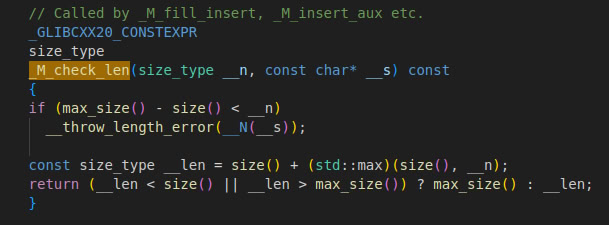

# Исходники STL

Если говорить про `g++` от `GCC`, то **STL** (`libstdc++`) реализована в большинстве случаев прямо в `.h`-файлах, поэтому можно посмотреть на исходный код библиотеки.

Стандартный путь исходников **STL** в Linux: `/usr/include/c++/<версия>/bits`

---

Ф-ция, которая определяет насколько увеличивать вектор когда память заканчивается 

---

Метод в std::list, который инициализирует ссылающийся сам на свои же концы senitel-узел

